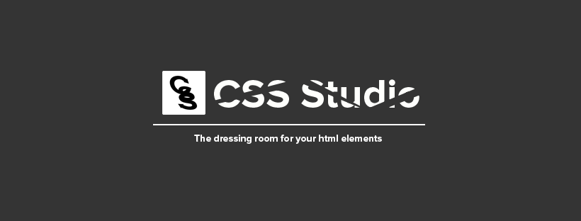

You are viewing the old code branch. Visit the main branch for the latest code.

## **CSS Studio - Web Client**

> **A special note from the developer**: CSS Studio was my first big web application project initially named 'jadgets'. I started developing it in November 2018 with the motive to test what i had learned in web development in previous years. During it's development i decided to launch it as a startup which i did in May 2019. Fortunately, within a couple of months it failed miserably and i ended up shutting it down due to unavailability of funds to keep the servers running. It was definitely not a good decision, i did not do the planning and had no experience in running a business but it taught me a lot of things. Although it's not something unimaginable but because it is very unlikely that i will relaunch it as a startup, today on 17th August 2021 i have decided to open source it with the hope of seeing it become something i had envisioned. Thank you for reading.
